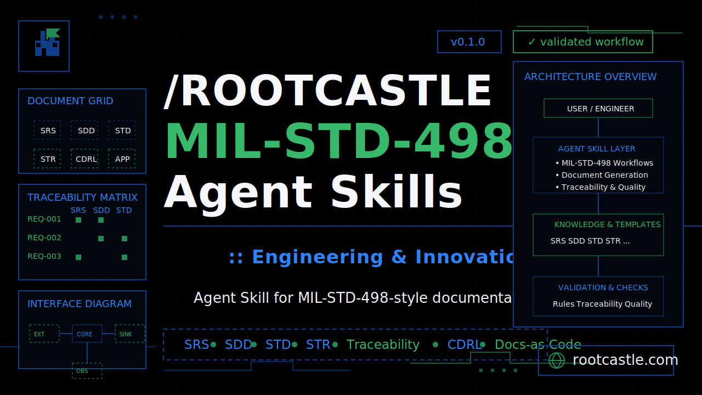

# /ROOTCASTLE MIL-STD-498 Skills

<p align="center">
  
</p>

**Engineering & Innovation | Mühendislik & İnovasyon**  
**rootcastle.com** — software, IoT/telematics, data infrastructure, prototyping, and defense-style engineering documentation.


> A Rootcastle-branded Agent Skills package for creating, tailoring, and reviewing MIL-STD-498-style software lifecycle documentation without pretending that a template equals contractual compliance.

## Tags

`rootcastle` · `rootcastle.com` · `mil-std-498` · `agent-skills` · `systems-engineering` · `software-lifecycle` · `requirements` · `sdd` · `srs` · `std` · `str` · `traceability` · `cdrl` · `documentation-as-code`

## Description

This repository contains the source and packaged archive for an Agent Skills workflow that helps produce rigorous MIL-STD-498-style documentation. It is designed for engineering teams that need structured requirements, design, test, release, installation, transition, interface, and traceability artifacts.

The skill emphasizes:

- stable document IDs and section structure;
- requirement-to-design-to-test traceability;
- CDRL/DID tailoring discipline;
- review checklists and readiness criteria;
- Markdown-first documentation-as-code workflows;
- security, observability, rollback, and verification evidence.

## Rootcastle branding

| Element | Value |
|---|---|
| Brand | Rootcastle Engineering & Innovation |
| Website | https://rootcastle.com |
| Identity | Retro/pixel engineering aesthetic, practical systems thinking, no-hype delivery |
| Core colors | `#000000`, `#0E3D8A`, `#228B55` |
| Engineering posture | Adapter/gateway isolation, feature flags, tests, observability, rollback, threat modeling |

## Repository structure

```text
.
├── README.md
├── skill.zip
├── assets/
│   └── rootcastle-mil-std-498-agent-skills-cover.svg
├── docs/
│   └── releases/
│       └── v0.1.0.md
├── examples/
│   └── telemetry-gateway/
│       ├── README.md
│       ├── SRS.md
│       ├── SDD.md
│       ├── STD.md
│       ├── STR.md
│       └── traceability.csv
└── mil-std-498/
    ├── SKILL.md
    ├── agents/
    │   └── openai.yaml
    ├── references/
    │   ├── did-catalog.md
    │   ├── document-structures.md
    │   ├── quality-checklist.md
    │   ├── source-index.md
    │   └── tailoring-and-cdrl.md
    └── scripts/
        ├── mil498_bootstrap.py
        └── validate_mil498_docs.py
```

## Included components

- `skill.zip` — packaged Agent Skills archive.
- `assets/rootcastle-mil-std-498-agent-skills-cover.svg` — Rootcastle repository cover image.
- `mil-std-498/SKILL.md` — main skill definition and invocation behavior.
- `mil-std-498/scripts/` — utility scripts for bootstrapping and validating document sets.
- `mil-std-498/references/` — DID catalog, document structures, tailoring guidance, and quality checks.
- `examples/telemetry-gateway/` — example SRS, SDD, STD, STR, and traceability matrix.
- `.github/workflows/validate-skill.yml` — GitHub Actions validation workflow.

## Usage

Review the skill definition first:

```bash
cat mil-std-498/SKILL.md
```

Generate a sample document set:

```bash
python3 mil-std-498/scripts/mil498_bootstrap.py \
  --project "Telemetry Gateway" \
  --dids SRS SDD STD STR SVD \
  --out generated-docs
```

Validate the generated set:

```bash
python3 mil-std-498/scripts/validate_mil498_docs.py generated-docs
```

Example agent prompt:

> Create a MIL-STD-498-style SRS + SDD + STD + STR + traceability matrix for a telemetry gateway. Keep the core domain isolated from integrations using adapters, gateways, and feature flags.

## Release

Current prepared release: **v0.1.0**

Release notes: `docs/releases/v0.1.0.md`

The branch `v0.1.0` exists as a release pointer. If using local Git, create the real Git tag from the latest `main` commit:

```bash
git fetch origin
git checkout main
git pull
git tag -f v0.1.0
git push -f origin v0.1.0
```

Then create a GitHub Release from `v0.1.0` and attach `skill.zip`.

## Compliance note

This repository supports MIL-STD-498-style documentation workflows. It does not, by itself, assert contractual compliance. For formal use, bind generated outputs to the controlling SOW, CDRL, DID revision, customer tailoring, review authority, and acceptance criteria.

## License / source note

This project references MIL-STD-498 conventions and public template structure. It does not reproduce the full upstream DID PDF text. Keep generated deliverables under project-specific review before contractual or defense-program use.

---

Built by **Rootcastle Engineering & Innovation** — https://rootcastle.com
